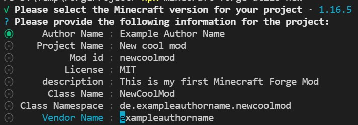

# Minecraft Forge Utils

The Minecraft Forge Utils simplify some of the manual tasks and allows a more
enjoying development experience.

## Requirements

- [Java Development Kit][java_jdk] (JDK)
- [NodeJS][node_js] (v7.0 or greater)
- [Visual Studio Code][visual_studio_code] or any other compatible JAVA IDE

## Installation (optional)

For better performance and offline capability reasons it is recommended to use a
local copy of the tools.

This can be done inside the project folder with the following command:
`npx minecraft-forge-utils init`

## How to use the utils

Use the **npx** command to run the utils with one of the commands in your
project folder.

## Commands

### init

The init command prepares the workspace and installs a local copy of the needed
tools for performance and offline capability.

Use the following command inside a empty folder:
`npx minecraft-forge-utils init`

After this was successful you should use the `npx minecraft-forge-utils new`
command to setup your new project.

### new

The new command creates a new project with the required folder and files. It
should be only used for new projects and never for existing projects.

To start a new project use `npx minecraft-forge-utils new` which will ask for
additional details like:



### add

The add commands gives you an selection of pre-defined templates which could be
used to create new blocks and items.

### create

The create command is used to create empty files for a specific group of items
or blocks.

Instead of creating 16 files manually for each color dye type you can just use:
`npx minecraft-forge-utils create files color <filename>`

Instead of creating 8 files manually for each wood type you can just use:
`npx minecraft-forge-utils create files wood <filename>`

### run / run client

The run / run client command tries to start a Minecraft client with your mod.

Example: `npx minecraft-forge-utils run`

## Templates

You can add your own templates for repeating pattern within your project.

### Template Format

The template engines tries to detect the correct settings on the given
information. You can only use the template engine, if the project was created
over the minecraft-forge-utils otherwise these information are missing.

#### Template Placeholders

The template engine provides the following basic placeholders:

- \[\[ --ModId-- ]]
- \[\[ --packageNamespace-- ]]

For items the following additional placeholders are provided:

- \[\[ --ItemName-- ]]
- \[\[ --ITEM_NAME-- ]]
- \[\[ --item_name-- ]]
- \[\[ --ItemClassName-- ]]

For blocks the following additional placeholders are provided:

- \[\[ --BLOCKNANE-- ]]
- \[\[ --BLOCK_NAME-- ]]
- \[\[ --BlockName-- ]]
- \[\[ --blockName-- ]]
- \[\[ --block_name-- ]]
- \[\[ --blockname-- ]]
- \[\[ --BlockClassName-- ]]

#### Template commands

The template engine knows four commands to handle most of the common use cases.

##### @@@ create @@@

This command create the file if not already include the whole path with the
given content, e.g:

```java
+++ models/item/[[ --block_name-- ]].json
@@@ create @@@
```

##### @@@ after: ... @@@

Adds the content after the give keyword, e.g:

```java
+++ block/ModBlocks.java
@@@ after:@TemplateEntryPoint("Register Blocks") @@@
```

##### @@@ before: ... @@@

Adds the content before the given keyword, e.g:

```java
+++ lang/en_us.json
@@@ before:"block.placeholder.text" @@@
```

##### @@@ copy:/.../ @@@

Copies the content from the given file, e.g:

```java
+++ textures/block/[[ --block_name-- ]].png
@@@ copy:/resources/textures/block/CustomBlock.png @@@
```

### Java Template

Your java template should be end with **.java**, a simple example looks like:

```java
+++ block/[[ --BlockClassName-- ]].java
@@@ create @@@

package [[ --packageNamespace-- ]].block;

import net.minecraft.world.level.block.Block;

public class [[ --BlockClassName-- ]] extends Block {
  public [[ --BlockClassName-- ]](Properties properties) {
      super(properties);
  }
}

+++ block/ModBlocks.java
@@@ after:@TemplateEntryPoint("Register Blocks") @@@
  public static final RegistryObject<Block> [[ --BLOCK_NAME-- ]] =
      BLOCKS.register("[[ --block_name-- ]]", () -> new [[ --BlockClassName-- ]](BlockBehaviour.Properties.of(Material.STONE)
          .requiresCorrectToolForDrops().strength(3.0F, 6.0F).sound([[ --SoundType-- ]])));

+++ item/ModItems.java
@@@ after:@TemplateEntryPoint("Register Block Items") @@@
  public static final RegistryObject<Item> [[ --BLOCK_NAME-- ]] =
      ITEMS.register("[[ --block_name-- ]]", () -> new BlockItem(ModBlocks.[[ --BLOCK_NAME-- ]].get(),
          new Item.Properties().tab(CreativeModeTab.TAB_BUILDING_BLOCKS)));
```

### Resource Template

Resource templates should be end with **.json**, a simple example looks like:

```json
+++ models/block/[[ --block_name-- ]].json
@@@ create @@@
{
  "parent": "block/cube_all",
  "textures": {
    "all": "[[ --ModId-- ]]:block/[[ --block_name-- ]]"
  }
}

+++ models/item/[[ --block_name-- ]].json
@@@ create @@@
{
  "parent": "[[ --ModId-- ]]:block/[[ --block_name-- ]]"
}

+++ blockstates/[[ --block_name-- ]].json
@@@ create @@@
{
  "variants": {
    "": { "model": "[[ --ModId-- ]]:block/[[ --block_name-- ]]" }
  }
}

+++ textures/block/[[ --block_name-- ]].png
@@@ copy:/resources/textures/block/CustomBlock.png @@@

+++ lang/en_us.json
@@@ before:"block.placeholder.text" @@@
  "block.[[ --ModId-- ]].[[ --block_name-- ]]": "[[ --BlockName-- ]]",
```

### Data Template

Data templates should be end with **.json**, a simple example looks like:

```json
+++ [[ --ModId-- ]]/loot_tables/blocks/[[ --block_name-- ]].json
@@@ create @@@
{
  "type": "minecraft:block",
  "pools": [
    {
      "rolls": 1,
      "bonus_rolls": 0,
      "entries": [
        {
          "type": "minecraft:item",
          "functions": [
            {
              "function": "minecraft:copy_name",
              "source": "block_entity"
            }
          ],
          "name": "[[ --ModId-- ]]:[[ --block_name-- ]]"
        }
      ],
      "conditions": [
        {
          "condition": "minecraft:survives_explosion"
        }
      ]
    }
  ]
}

+++ minecraft/tags/blocks/mineable/pickaxe.json
@@@ after:"values": [ @@@
    "[[ --ModId-- ]]:[[ --block_name-- ]]",

+++ minecraft/tags/blocks/needs_iron_tool.json
@@@ after:"values": [ @@@
    "[[ --ModId-- ]]:[[ --block_name-- ]]",
```

### Mixed Template

Mixed templates should be end with **.template**. The template engine will try
it best to detect the correct paths based on the given information. But in some
cases it could be that it's not recognize the correct path and you need to split
the files for the specific use-case.

Full example:

```java
+++ block/ModBlocks.java
@@@ after:@TemplateEntryPoint("Register Blocks") @@@

  public static final RegistryObject<Block> [[ --BLOCK_NAME-- ]]_HALF_SLAP =
      BLOCKS.register([[ --block_name-- ]]_half_slab", () -> new HalfSlabBlock(Blocks.[[ --BLOCK_NAME-- ]]_BLOCK));

+++ items/ModItems.java
@@@ after:@TemplateEntryPoint("Register Block Items") @@@

  public static final RegistryObject<Item> [[ --BLOCK_NAME-- ]]_HALF_SLAP =
        ITEMS.register("[[ --block_name-- ]]_slab", () -> new BlockItem(ModBlocks.[[ --BLOCK_NAME-- ]]_HALF_SLAP.get(),
            new Item.Properties().tab(MaterialElementsTab.TAB_PANEL_PLATES)));

+++ blockstates/[[ --block_name-- ]].json
@@@ create @@@
{
  "variants": {
    "face=floor": {
      "model": "[[ --ModId-- ]]:block/half_slab/[[ --block_name-- ]]_half_slab"
    },
    "face=wall,facing=north": {
      "model": "[[ --ModId-- ]]:block/half_slab/[[ --block_name-- ]]_half_slab",
      "x": 270,
      "y": 180
    },
    "face=wall,facing=east": {
      "model": "[[ --ModId-- ]]:block/half_slab/[[ --block_name-- ]]_half_slab",
      "x": 270,
      "y": 270
    },
    "face=wall,facing=south": {
      "model": "[[ --ModId-- ]]:block/half_slab/[[ --block_name-- ]]_half_slab",
      "x": 270
    },
    "face=wall,facing=west": {
      "model": "[[ --ModId-- ]]:block/half_slab/[[ --block_name-- ]]_half_slab",
      "x": 270,
      "y": 90
    },
    "face=ceiling": {
      "model": "[[ --ModId-- ]]:block/half_slab/[[ --block_name-- ]]_half_slab",
      "x": 180
    }
  }
}

+++ models/block/half_slab/[[ --block_name-- ]]_half_slab.json
@@@ create @@@
{
  "parent": "material_elements_panels_plates_slabs:block/template/half_slab",
  "textures": {
    "texture": "minecraft:block/[[ --block_name-- ]]_planks",
    "particle": "minecraft:block/[[ --block_name-- ]]_planks"
  }
}

+++ models/items/[[ --block_name-- ]]_half_slab.json
@@@ create @@@
{
  "parent": "[[ --ModId-- ]]:block/half_slab/[[ --block_name-- ]]_half_slab"
}

+++ loot_tables/blocks/[[ --block_name-- ]].json
@@@ create @@@
{
  "type": "minecraft:block",
  "pools": [
    {
      "rolls": 1,
      "bonus_rolls": 0,
      "entries": [
        {
          "type": "minecraft:item",
          "functions": [
            {
              "function": "minecraft:copy_name",
              "source": "block_entity"
            }
          ],
          "name": "[[ --ModId-- ]]:[[ --block_name-- ]]_half_slab"
        }
      ],
      "conditions": [
        {
          "condition": "minecraft:survives_explosion"
        }
      ]
    }
  ]
}

+++ recipes/[[ --block_name-- ]]_from_[[ --block_name-- ]]_planks_by_stonecutter.json
@@@ create @@@
{
  "type": "minecraft:stonecutting",
  "ingredient": {
    "item": "minecraft:[[ --block_name-- ]]_planks"
  },
  "result": "[[ --ModId-- ]]:[[ --block_name-- ]]_half_slab",
  "count": 4
}


+++ recipes/[[ --block_name-- ]]_from_[[ --block_name-- ]]_slab_by_stonecutter.json
@@@ create @@@
{
  "type": "minecraft:stonecutting",
  "ingredient": {
    "item": "minecraft:[[ --block_name-- ]]_slab"
  },
  "result": "[[ --ModId-- ]]:[[ --block_name-- ]]_half_slab",
  "count": 2
}

+++ minecraft/tags/blocks/mineable/pickaxe.json
@@@ after:"values": [ @@@
    "[[ --ModId-- ]]:[[ --block_name-- ]]",

+++ minecraft/tags/blocks/needs_iron_tool.json
@@@ after:"values": [ @@@
    "[[ --ModId-- ]]:[[ --block_name-- ]]",
```

## Disclaimer

NOT OFFICIAL MINECRAFT PRODUCT. NOT APPROVED BY OR ASSOCIATED WITH MOJANG.

[java_jdk]: https://www.oracle.com/java/technologies/downloads/
[node_js]: https://nodejs.org/
[visual_studio_code]: https://code.visualstudio.com/
